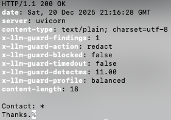
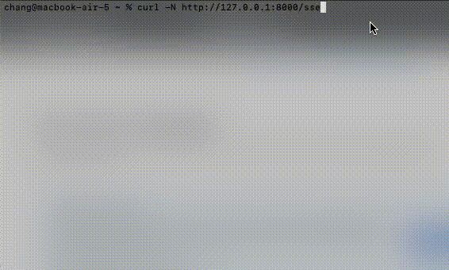

# llm-output-guard

Starlette middleware + CLI to scan/block/redact risky LLM outputs (PII, secrets, unsafe tool calls). Includes HTTP and streaming middleware, YAML policy profiles, SARIF output, and reproducible before/after traces.

Repository: https://github.com/Jasonti20/llm-output-guard

## Features

- **Starlette HTTP middleware**: buffers and scans `text/*` and `application/json` responses before sending to clients.
- **Streaming middleware (SSE/text)**: incremental scanning/redaction with cross-chunk detection and a holdback window.
- **Detectors**:
  - **PII**: credit cards (Luhn), SSN, emails, phones (E.164)
  - **Secrets**: JWT, PEM keys, known prefixes (AKIA, sk-, ghp_, xoxb-), encoding-aware scans (URL/base64/powershell -enc)
  - **Tools**: risky shell patterns, SQL `DROP`, PowerShell IEX, markdown link deception
  - **Prompt injection**: conservative prompt-leak patterns (English + Chinese)
- **Policies**: `balanced` (default), `strict`, `permissive` via YAML.
- **CLI**: offline scanner (`json | pretty | sarif`) with CI-friendly exit codes.
- **Dev tooling**: pre-commit hook; SARIF for code-scanning UIs.
- **Proof artifacts**:
  - before/after traces under `examples/traces_before_after/`
  - red-team dataset `examples/redteam.jsonl`
  - reports under `reports/`

## Badges

[](LICENSE)  
[](pyproject.toml)  
[](https://github.com/astral-sh/ruff)

## Quickstart

### Install

```bash
pip install -e .
```

### 60-Second Example (Starlette)

```python
from starlette.applications import Starlette
from starlette.responses import PlainTextResponse
from starlette.routing import Route
from llm_output_guard.middleware.starlette_http import OutputGuardMiddleware

async def chat(request):
    return PlainTextResponse("My email is alice@acme.co and card 4111111111111111")

app = Starlette(routes=[Route("/chat", chat)])
app.add_middleware(OutputGuardMiddleware, profile="balanced")

# Run: uvicorn app:app --port 8001
# Try: curl http://localhost:8001/chat
# Result: email redacted, response blocked (422) for credit card
```

### CLI Usage

Scan files or stdin for risky content:

```bash
# Pretty output
guard scan --in output.txt --format pretty --profile balanced

# JSON output for CI/CD
echo "My API key: sk-abc123xyz" | guard scan --in - --format json

# SARIF for code scanning
guard scan --in logs.txt --format sarif > results.sarif
```

Exit codes: 0 (clean), 1 (flag), 2 (redact), 3 (block)

## Performance

Benchmarked on Apple M-series, `balanced` profile:

| Payload Size | p50 (ms/1k) | p95 (ms/1k) |
|--------------|-------------|-------------|
| 10k chars    | 0.79        | 0.82        |
| 50k chars    | 0.60        | 0.61        |
| 100k chars   | 0.58        | 0.59        |

Typical 10k LLM response: **~8ms** detection latency (p95).

## Demos

### HTTP Response Redaction


### Streaming Redaction (SSE)


## Proof Artifacts

- **Before/after traces**: See [`examples/traces_before_after/`](examples/traces_before_after/) for reproducible cases (credit card, PEM key, email/phone).
- **Red-team dataset**: [`examples/redteam.jsonl`](examples/redteam.jsonl) — 10 adversarial prompts (jailbreak, secrets, encodings).
- **Evaluation reports**:
  - [Red-team results CSV](reports/redteam_results.csv) — Guarded vs. unguarded comparisons
  - [RAG faithfulness report](reports/rag_report.html) — Sample hallucination metrics

## Usage

### HTTP Middleware

```python
from llm_output_guard.middleware.starlette_http import OutputGuardMiddleware

app.add_middleware(
    OutputGuardMiddleware,
    profile="balanced",  # or "strict", "permissive"
    coerce_block_to_redact=False,  # True for streaming safety
    include_debug_headers=True,  # timing/truncation headers
)
```

### Streaming Middleware (SSE/Text)

```python
from llm_output_guard.middleware.streaming import StreamingOutputGuardMiddleware

app.add_middleware(
    StreamingOutputGuardMiddleware,
    profile="balanced",
    block_critical_stream=True,  # stop stream on PEM key headers
    holdback_chars=64,  # buffer tail for cross-chunk detection
)
```

### Custom Policy

```python
from llm_output_guard.policy.loader import load_policy_from_file

policy = load_policy_from_file("custom.yaml", profile="myprofile")
app.add_middleware(OutputGuardMiddleware, policy=policy)
```

See [`llm_output_guard/policy/examples/policy.yaml`](llm_output_guard/policy/examples/policy.yaml) for structure
